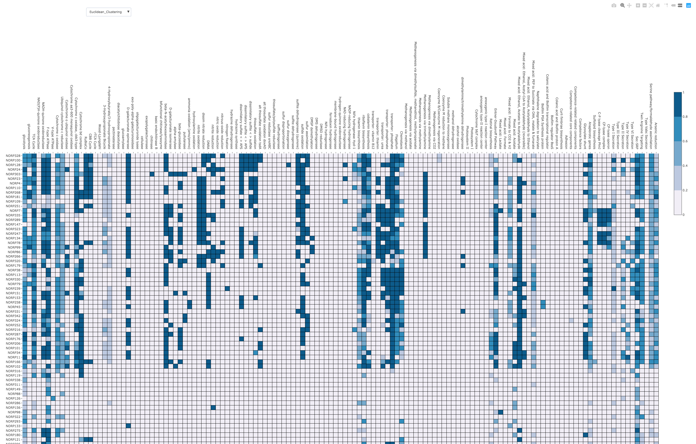

# KEGGDecoder-binder
To calculate metabolic pathway completeness and build heatmaps from [GhostKOALA](https://www.kegg.jp/ghostkoala/) output via KEGGDecoder.

This binder provides instructions and demo for the [KEGGDecoder](https://github.com/bjtully/BioData/tree/master/KEGGDecoder) tool, which makes a metabolic heatmap. The package was developed by Ben Tully and expanded during the [Speeding Up Science workshop](https://speeding-up-science-workshops.github.io/speeding-up-science/) by Jay Osvatic, Roth Conrad, Luiz Irber, and Taylor Reiter. 

# Quick Start
1) Launch the binder with the button above. This will take a few minutes to load.
2) Upload your ghostKOALA output to the Jupyter Notebook in your binder session with the Upload button near the top right of that page.
3) Select New Python 3 Notebook from the New button next to the Upload button. This will open in a new tab.
4) From this Python session execute: !KEGG-decoder --input Example_input_data.txt --output Example_output_data.tsv --vizoption interactive
5) Return to the first binder session tab and click on the new function_heatmap.html file to open it in a new tab.
6) Explore.

For more detailed instructions review documents in example_notebooks directory from within the Binder session.

# Example Output

